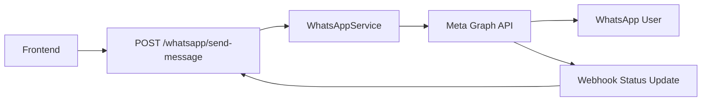

# WhatsApp Cloud API Integration - Implementation Guide

## Overview

Complete WhatsApp Business Cloud API integration has been implemented for the OmniChannel SaaS Platform. This enables businesses to send and receive WhatsApp messages, manage templates, and handle webhooks from Meta.

---

## 🎯 What's Implemented

### 1. WhatsApp Service (`whatsapp.service.ts`)

Core service for interacting with Meta's WhatsApp Cloud API.

**Features**:
- ✅ Send text messages
- ✅ Send template messages (for campaigns)
- ✅ Send media (image, video, document, audio)
- ✅ Mark messages as read
- ✅ Get message templates
- ✅ Create message templates
- ✅ Process incoming webhooks
- ✅ Handle status updates (delivered, read, failed)

**Methods**:

```typescript
// Send text message
await whatsappService.sendTextMessage(channelId, to, message);

// Send template message
await whatsappService.sendTemplateMessage(
  channelId,
  to,
  templateName,
  languageCode,
  components
);

// Send media
await whatsappService.sendMediaMessage(
  channelId,
  to,
  'image',
  'https://example.com/image.jpg',
  'Optional caption'
);

// Get templates
await whatsappService.getTemplates(channelId);

// Create template
await whatsappService.createTemplate(channelId, templateData);
```

### 2. Webhook Service (`whatsapp-webhook.service.ts`)

Handles Meta webhook verification and security.

**Features**:
- ✅ Webhook URL verification (GET request)
- ✅ Signature validation (SHA-256 HMAC)
- ✅ Payload parsing and validation
- ✅ Event type detection
- ✅ Debug logging

**Security**:
- Verifies requests actually come from Meta
- Uses cryptographic signature validation
- Prevents replay attacks

### 3. WhatsApp Controller (`whatsapp.controller.ts`)

HTTP endpoints for WhatsApp integration.

**Endpoints**:

| Method | Endpoint | Purpose |
|--------|----------|---------|
| GET | `/whatsapp/webhook` | Webhook verification |
| POST | `/whatsapp/webhook` | Receive incoming events |
| POST | `/whatsapp/send-message` | Send text message |
| POST | `/whatsapp/send-template` | Send template message |
| POST | `/whatsapp/send-media` | Send media message |
| GET | `/whatsapp/templates/:channelId` | Get templates |
| POST | `/whatsapp/templates` | Create template |

---

## 📋 Setup Instructions

### 1. Meta Developer Account Setup

1. **Create Meta App**:
   - Go to https://developers.facebook.com
   - Create new app → Business type
   - Add WhatsApp product

2. **Get Credentials**:
   - App ID
   - App Secret
   - WhatsApp Business Account ID (WABA)
   - Phone Number ID
   - Access Token (permanent token recommended)

3. **Update `.env`**:
   ```env
   META_APP_ID=your-app-id
   META_APP_SECRET=your-app-secret
   META_VERIFY_TOKEN=create-random-string-here
   META_WEBHOOK_URL=https://yourdomain.com/api/v1/whatsapp/webhook
   ```

### 2. Webhook Configuration

1. **Set up webhook** in Meta App dashboard:
   - Callback URL: `https://yourdomain.com/api/v1/whatsapp/webhook`
   - Verify Token: (same as `META_VERIFY_TOKEN` in .env)
   - Subscribe to fields:
     - `messages`
     - `message_status`

2. **Test webhook verification**:
   ```bash
   # Meta will send GET request like this:
   GET /whatsapp/webhook?hub.mode=subscribe&hub.verify_token=YOUR_TOKEN&hub.challenge=CHALLENGE_STRING
   
   # Your server should return the challenge string
   ```

### 3. Connect WhatsApp Channel

Create a channel record in the database:

```sql
INSERT INTO channels (
  tenant_id,
  type,
  name,
  status,
  credentials
) VALUES (
  'tenant-uuid',
  'whatsapp',
  'Main WhatsApp',
  'active',
  '{"phoneNumberId": "123456789", "wabaId": "987654321", "accessToken": "EAAxxxxx"}'
);
```

---

## 🔄 Message Flow

### Outbound (Sending)



### Inbound (Receiving)

```mermaid
graph LR
    A[WhatsApp User] --> B[Meta]
    B --> C[POST /whatsapp/webhook]
    C --> D[Verify Signature]
    D --> E[WhatsAppService.processIncomingMessage]
    E --> F[Find/Create Contact]
    F --> G[Find/Create Conversation]
    G --> H[Create Message]
    H --> I[Emit WebSocket Event]
    I --> J[Frontend Updates]
```



---

## 💬 Message Types Supported

### 1. Text Messages

```typescript
POST /whatsapp/send-message
{
  "channelId": "channel-uuid",
  "to": "1234567890",
  "message": "Hello from OmniChannel!"
}
```

**Incoming**:
- Automatically creates contact
- Creates/updates conversation
- Stores in database
- Emits real-time event

### 2. Template Messages

Used for:
- Marketing campaigns
- Notifications
- Alerts
- First-contact messages (outside 24h window)

```typescript
POST /whatsapp/send-template
{
  "channelId": "channel-uuid",
  "to": "1234567890",
  "templateName": "hello_world",
  "languageCode": "en",
  "components": []
}
```

**Template Categories**:
- `MARKETING` - Promotional content
- `UTILITY` - Account updates, reminders
- `AUTHENTICATION` - OTP codes

### 3. Media Messages

Supported types:
- Image (JPEG, PNG)
- Video (MP4, 3GPP)
- Document (PDF, DOC, etc.)
- Audio (AAC, MP3, OGG)

```typescript
POST /whatsapp/send-media
{
  "channelId": "channel-uuid",
  "to": "1234567890",
  "mediaType": "image",
  "mediaUrl": "https://example.com/image.jpg",
  "caption": "Check this out!"
}
```

### 4. Location, Contacts (Future)

Can be added following the same pattern.

---

## 🔐 Security Features

### 1. Signature Validation

Every webhook request is validated:

```typescript
// In whatsapp-webhook.service.ts
verifySignature(signature: string, payload: string): boolean {
  const appSecret = this.configService.get('META_APP_SECRET');
  const expectedSignature = crypto
    .createHmac('sha256', appSecret)
    .update(payload)
    .digest('hex');
  
  return crypto.timingSafeEqual(
    Buffer.from(signatureHash),
    Buffer.from(expectedSignature)
  );
}
```

### 2. Verify Token

Prevents unauthorized webhook subscriptions.

### 3. Tenant Isolation

Messages are automatically scoped to the correct tenant based on phone number ID.

---

## 📊 Status Tracking

Messages have the following lifecycle:

1. **pending** - Created, not sent yet
2. **sent** - Sent to Meta
3. **delivered** - Delivered to recipient's phone
4. **read** - Read by recipient
5. **failed** - Delivery failed

Status updates come via webhook and are stored in the message entity.

---

## 🧪 Testing

### Test Sending

```bash
# Send text message
curl -X POST http://localhost:3001/api/v1/whatsapp/send-message \
  -H "Content-Type: application/json" \
  -H "Authorization: Bearer YOUR_JWT" \
  -d '{
    "channelId": "your-channel-id",
    "to": "1234567890",
    "message": "Test message"
  }'
```

### Test Webhook (Local Development)

Use ngrok to expose local server:

```bash
# Install ngrok
brew install ngrok

# Expose port 3001
ngrok http 3001

# Use the generated URL in Meta webhook config
# Example: https://abc123.ngrok.io/api/v1/whatsapp/webhook
```

### Test Incoming Messages

Send a WhatsApp message to your connected phone number. Check:
1. Webhook receives event
2. Signature is validated
3. Contact is created/found
4. Conversation is created/found
5. Message is stored
6. WebSocket event is emitted

---

## 🚀 Advanced Features

### Campaign Sending

Use template messages for campaigns:

```typescript
// Example: Send welcome campaign
const contacts = await getContactList();

for (const contact of contacts) {
  await whatsappService.sendTemplateMessage(
    channelId,
    contact.phone,
    'welcome_campaign',
    'en',
    [
      {
        type: 'body',
        parameters: [
          { type: 'text', text: contact.firstName }
        ]
      }
    ]
  );
}
```

### Interactive Messages (Buttons, Lists)

Can be added by extending the service:

```typescript
// Future implementation
async sendInteractiveMessage(channelId, to, interactiveData) {
  const payload = {
    messaging_product: 'whatsapp',
    to: to,
    type: 'interactive',
    interactive: interactiveData
  };
  // ... send via API
}
```

### Media Handling

For incoming media:
1. Webhook contains media ID
2. Download using Graph API
3. Store in cloud storage (S3, etc.)
4. Store URL in message.mediaAttachments

---

## 📝 Database Schema

### Channel Entity

```typescript
{
  id: string;
  tenantId: string;
  type: 'whatsapp';
  name: string;
  status: 'active' | 'inactive' | 'error';
  credentials: {
    phoneNumberId: string;  // From Meta
    wabaId: string;         // WhatsApp Business Account ID
    accessToken: string;    // Permanent access token
  };
  settings: {
    autoReply: boolean;
    businessHours: {...};
  };
}
```

### Message Flow

```typescript
// Incoming message creates:
1. Contact (if new)
2. Conversation (if new)
3. Message with platformMessageId
4. WebSocket event to frontend
```

---

## 🔧 Troubleshooting

### Error: "Invalid channel configuration"

- Check channel credentials in database
- Verify phoneNumberId and accessToken are correct
- Ensure channel status is 'active'

### Error: "Webhook signature verification failed"

- Check META_APP_SECRET matches Meta app
- Ensure webhook is using POST with raw body
- Check NestJS raw body configuration

### Messages not being received

- Verify webhook is registered in Meta dashboard
- Check webhook URL is publicly accessible (use ngrok for local)
- Verify META_VERIFY_TOKEN matches
- Check webhook subscription fields include 'messages'

### Template sending fails

- Ensure template is approved in Meta Business Manager
- Check language code matches template
- Verify component parameters match template structure

---

## 📚 Additional Resources

- [Meta WhatsApp Business API Docs](https://developers.facebook.com/docs/whatsapp/cloud-api)
- [Webhook Reference](https://developers.facebook.com/docs/whatsapp/cloud-api/webhooks)
- [Message Templates Guide](https://developers.facebook.com/docs/whatsapp/business-management-api/message-templates)
- [Media Messages](https://developers.facebook.com/docs/whatsapp/cloud-api/reference/media)

---

## ✅ Checklist for Production

- [ ] Get production Meta app approved
- [ ] Set up permanent access token
- [ ] Configure webhook with HTTPS URL
- [ ] Test all message types
- [ ] Set up error monitoring
- [ ] Configure rate limiting
- [ ] Add message queue for high volume
- [ ] Set up media storage (S3/CloudFront)
- [ ] Add conversation assignment logic
- [ ] Implement business hours
- [ ] Add auto-reply templates
- [ ] Configure opt-in/opt-out handling

---

**Status**: Core WhatsApp integration complete and ready for testing with real Meta credentials.
